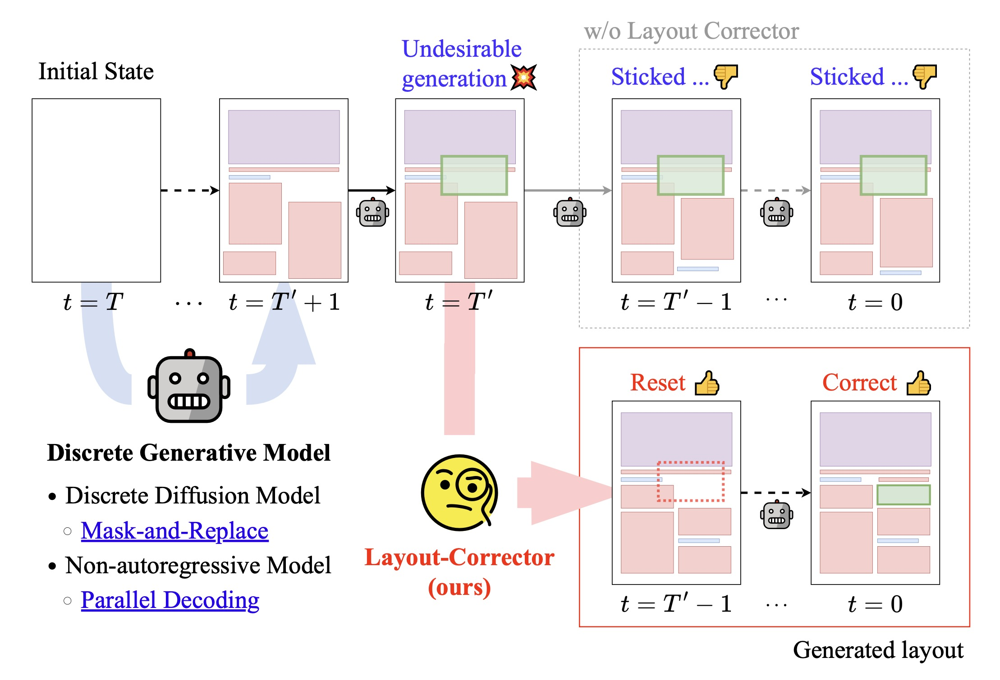

# [ECCV2024] Layout-Corrector: Alleviating Layout Sticking Phenomenon in Discrete Diffusion Model

[[Paper (ECVA)]](https://www.ecva.net/papers/eccv_2024/papers_ECCV/html/4969_ECCV_2024_paper.php)
[[Project page]](https://iwa-shi.github.io/Layout-Corrector-Project-Page/)
[[Supplementary material]](https://www.ecva.net/papers/eccv_2024/papers_ECCV/papers/04969-supp.pdf)
[[Video]](https://youtu.be/rk1G8GrlO3g)


This is the official PyTorch implementation of 
"Layout-Corrector: Alleviating Layout Sticking Phenomenon in Discrete Diffusion Model (ECCV2024)".

[Shoma Iwai<sup>1</sup>](https://iwa-shi.github.io/), Atsuki Osanai<sup>2</sup>, [Shunsuke Kitada<sup>2</sup>](https://shunk031.me/), and [Shinichiro Omachi<sup>1</sup>](http://www.iic.ecei.tohoku.ac.jp/~machi/index-e.html)

<sup>1</sup> Tohoku University, <sup>2</sup> LY Corporation




# Setup
<details>
<summary>Setup details</summary>

## Making environment with pip (Recommended)

The environment is constructed under `Python 3.10`.

- Run the container for Development

    ```bash
    make build
    make run
    --- in container ---
    cd /app
    pip3 install -e .
    ```

## Download Starter Kit (Datasets, Pre-trained Models, etc.)
Please download the [starter kit (GDrive, 952 MB)](https://drive.google.com/file/d/1og3l0enR67rDwiAN44K4RchcFYAgsbNq/view) and unzip it:
```bash
unzip ./layout_corrector_starter_kit.zip
```
For more details about the starter kit, please refer to the README.md file included in the zip.


### [Optional] Custom Dataset
PubLayNet, Rico, and Crello datasets are included in our starter kit.
For custom datasets, see [docs/custom_dataset.md](./docs/custom_dataset.md)

</details>

---


# Training

<details>
<summary>Training details</summary>

### LayoutDM, VQDiffusion, MaskGIT
```bash
bash bin/train.sh <DATASET> <EXPERIMENT_NAME> <ADDITIONAL_ARGS>
```

For example, 
```bash
bash bin/train.sh rico25 layoutdm seed=0,1,2
```

### Layout-Corrector
```bash
bash bin/corrector_train.sh <DATASET> <EXPERIMENT_NAME> <DIFFUSION_JOB_DIR> <ADDITIONAL_ARGS>
```
- `<EXPERIMENT_NAME>`: Filename of .yaml file in `src/trainer/trainer/config/experiment`.
- `<DIFFUSION_JOB_DIR>`: Job directory of pre-trained diffusion model (e.g., LayoutDM)
- `<ADDITIONAL_ARGS>`: Optional (e.g., `seed=0,1,2`)

For example, 
```bash
bash bin/corrector_train.sh rico25 layout_corrector download/pretrained_weights/rico25/layoutdm seed=0,1,2 training.epochs=20
```

</details>


---


# Testing

<details>
<summary>Testing details</summary>

You can try a quick demo using `notebooks/demo.ipynb`.

To generate layouts and calculate metrics, run the following commands:

### LayoutDM, VQDiffusion, MaskGIT
```bash
python bin/test_eval.py <DIFFUSION_JOB_DIR> <DATASET> -t <TIMESTEPS> [-d <DEVICE_ID>]
```

For example, 
```bash
python bin/test_eval.py tmp/jobs/rico25/layoutdm_jobdir rico25 -t 100
```

### DDM + Layout-Corrector (Ours)
```bash
python ./bin/corrector_test_eval.py <JOB_DIR> <DATASET> -t <NUM_TIMESTEPS> [-d <DEVICE_ID>]
```
- `<JOB_DIR>`: Path to the pre-trained corrector job_dir (not that of a generator).

For example, 
```bash
python ./bin/corrector_test_eval.py ./download/pretrained_weights/layout_corrector rico25 -t 100
```

### Masking Methods in Layout-Corrector

#### Threshold-masking (Default)
- To specify threshold-masking, add `--corrector_mask_mode thresh --corrector_mask_threshold <THRESHOLD>`:
```bash
python ./bin/corrector_test_eval.py ./download/pretrained_weights/rico25/layout_corrector rico25 -t 100 --corrector_mask_mode thresh --corrector_mask_threshold 0.7 
```

#### Top-K-masking
- To specify Top-K-masking, add `--corrector_mask_mode topk`:
```bash
python ./bin/corrector_test_eval.py ./download/pretrained_weights/rico25/layout_corrector rico25 -t 100 --corrector_mask_mode topk
```

</details>

---


# Preliminary Experiments and Analysis

<details>
<summary>Preliminary Experiment details</summary>

### Token-Correction Test
Test Corrupted Token-Correction Capability of LayoutDM and its conjunction with Layout-Corrector.

```bash
python bin/test_token_correction.py <LAYOUTDM_JOB_DIR> [--start_timesteps <TIMESTEP1> <TIMESTEP2> ...] [--mask] [--num_replace <NUM_REPLACE_TOKENS>] [--save_dir <SAVE_DIR>]
```

- `--start_timesteps`: The start timesteps when the generation runs from (default: [10]).
- `--mask`: If given, the randomly selected tokens are replaced with MASK.
- `--num_replace`: The number of tokens to be replaced (default: 1).
- `--save_dir`: A directory where the result is saved (default: `token_correction_results`).

The result `json` includes two metrics.
- `token_wise`: The token-wise accuracy of restoring the corrupted tokens to the ground truth.
- `full`: Requiring to correctly restore all corrupted tokens.

To compare the token correction capability for different schedules, as in Fig.2 (b) of our paper, please see [layoutdm_token_correction.ipynb](./notebooks/layoutdm_token_correction.ipynb).

### Corrupted Token Detection Test for Corrector
Test Corrupted Token Detection Accuracy of Layout-Corrector.

```bash
python bin/test_error_token_detection.py <LAYOUTDM_JOB_DIR> --corr_job_dir <CORRECTOR_JOB_DIR> --corr_timesteps <CORR_TIMESTEP1> <CORR_TIMESTEP2> ... [--num_replace <NUM_REPLACE_TOKENS>] [--save_dir <SAVE_DIR>]
```

- `--corr_job_dir`: Corrector job directory where ckpt is included. If not given, the evaluation runs only for LayoutDM. 
- `--corr_timesteps`: The timesteps at which the corrector is applied (default: [10]).
- `--num_replace`: The number of tokens to be replaced (default: 1).
- `--save_dir`: A directory where the result is saved (default: `error_token_detection_results`).

The result `json` includes two metrics at each timestep.
- `token_wise_acc`: The token-wise accuracy of detecting the corrupted tokens.
- `full_acc`: Requiring to correctly detect all corrupted tokens.

To plot the accuracy of corrupted token detection, as in Fig.4 of our paper, please see [layout_corrector_error_token_detection.ipynb](./notebooks/layout_corrector_error_token_detection.ipynb).

### Visualize Generation Process
Save Layout Generation Process at all timesteps as a pickle file and images.

```bash
python tools/visualize_generation_process.py <LAYOUTDM_JOB_DIR> [--corr_job_dir <CORRECTOR_JOB_DIR>] [--num_samples <NUM_SAMPLES>]  [--corr_timesteps <CORR_TIMESTEP1> <CORR_TIMESTEP2> ...] [--save_dir <SAVE_DIR>] [--save_images]
```

- `--corr_job_dir`: Corrector job directory where ckpt is included. If not given, the results are by just LayoutDM. 
- `--num_samples`: The total number of generated samples (default: 100).
- `--corr_timesteps`: The timesteps at which the corrector is applied (default: [10, 20, 30]).
- `--corrector_mask_mode`: The masking strategy for the corrector. `topk` or `thresh` are allowed (default: `thresh`).
- `--corrector_threshold`: The threshold value to determine tokens to reset to MASK when `corrector_mask_mode == "thresh"` (default: 0.7).
- `--save_dir`: A directory where the result is saved (default: `generation_process_results`).
- `--save_images`: Whether saving the results as images or not.


### Analyze Sticking Rate
Plot the token and element sticking rate of LayoutDM.
Note that you need to run `tools/visualize_generation_process.py` before using this tool.
The output is saved in the directory where the pickle file is located.

```bash
python tools/analyze_token_sticking.py <PICKLE_PATH>
```

To compare the sticking rate for different schedules, as in Fig.2 (a) of our paper, please see [layoutdm_token_sticking.ipynb](./notebooks/layoutdm_token_sticking.ipynb).


</details>

---

## Acknowledgement
This codebase is largely based on [LayoutDM (Inoue+, CVPR2023)](https://github.com/CyberAgentAILab/layout-dm). We sincerely appreciate their effort and contribution to the research community.


## Citation

If you find this code useful for your research, please consider citing our paper:

```
@inproceedings{iwai2024layout,
  title={Layout-Corrector: Alleviating Layout Sticking Phenomenon in Discrete Diffusion Model},
  author={Shoma Iwai and Atsuki Osanai and Shunsuke Kitada and Shinichiro Omachi},
  booktitle={Proceedings of the European Conference on Computer Vision (ECCV)},
  year={2024},
}
```

## Issues
- If you have any questions or encounterd any issues, please feel free to open an issue!
- Pull requests are welcome! We hope to open an issue first to discuss what you would like to change.

## License
[MIT](./LICENSE)
